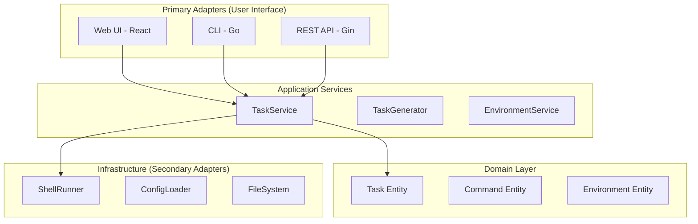

# 🚀 Tech Talk: "From Monolith to Configuration-Driven Development"

## 📋 **AGENDA COMPLETA** (75 minutos)

### 1. **Introducción al Problema** (5 min)
- Desafíos del desarrollo tradicional
- Necesidad de escalabilidad y flexibilidad
- Objetivos de la arquitectura

### 2. **Arquitectura Hexagonal** (10 min)
- Principios y beneficios
- Implementación en Go
- Separación de responsabilidades

### 3. **Configuration-Driven Development** (15 min)
- Concepto y ventajas
- Implementación práctica
- Casos de uso reales

### 4. **Domain-Specific Language** (10 min)
- Diseño del DSL
- Sintaxis y expresividad
- Extensibilidad

### 5. **Demo en Vivo** (15 min)
- Configuración de nueva funcionalidad
- Formularios dinámicos
- Progreso visual en tiempo real

### 6. **Patrones de Diseño** (10 min)
- Patrones implementados
- Beneficios y trade-offs
- Lecciones aprendidas

### 7. **Q&A** (10 min)

---

## 🎯 **1. INTRODUCCIÓN AL PROBLEMA** (5 minutos)

### **Slide 1: Título**
*[Aparecer en pantalla]*
```
🚀 From Monolith to Configuration-Driven Development
```

**GUION:**
"Buenos días a todos. Mi nombre es [Tu Nombre] y hoy voy a compartir con ustedes una historia de transformación arquitectónica que cambió completamente la forma en que desarrollamos software."

### **Slide 2: El Problema**
*[Mostrar código tradicional vs configuración]*

**GUION:**
"Todo comenzó con una pregunta simple: ¿Cuántas veces han tenido que esperar semanas para implementar una feature que en realidad solo requería hacer un GET y mostrarlo en una tabla, o llenar un formulario y enviarlo a un POST?"

*[Pausa para reflexión]*

"En nuestro equipo, esto era una realidad diaria. Cada nueva funcionalidad requería:
- Desarrollo específico de componentes
- Testing complejo de integración
- Deployment frecuente de cambios
- Dependencia total de desarrolladores
- Time-to-market de 2-4 semanas"

### **Slide 3: Nuestra Solución**
*[Mostrar JSON de configuración]*

**GUION:**
"Entonces nos preguntamos: ¿Qué pasaría si pudiéramos definir QUÉ queremos hacer, en lugar de CÓMO hacerlo?"

*[Mostrar el JSON]*
"Esto es lo que logramos. Una nueva funcionalidad, completamente operativa, definida en configuración. Sin código. Sin deployment. Sin esperas."

### **Objetivos Alcanzados**
- ✅ **Zero-Code Development**: Features sin escribir código
- ✅ **Business User Empowerment**: Usuarios crean workflows
- ✅ **Scalability**: Sistema crece automáticamente
- ✅ **Maintainability**: Código genérico y reutilizable

---

## 🏗️ **2. ARQUITECTURA HEXAGONAL** (10 minutos)

### **Slide 4: ¿Por qué Hexagonal?**
*[Diagrama de arquitectura]*

**GUION:**
"Para lograr esto, necesitábamos una arquitectura que nos permitiera separar claramente las responsabilidades. Elegimos la Arquitectura Hexagonal, también conocida como Ports & Adapters."

### **Slide 5: Principios Fundamentales**
*[Diagrama Mermaid]*

**GUION:**
"La arquitectura hexagonal se basa en un principio simple: el dominio de negocio está en el centro, y todo lo demás son adaptadores."

*[Explicar el diagrama]*
"En el centro tenemos nuestro dominio: las entidades Task, Command, Environment. Alrededor, los servicios de aplicación que implementan la lógica de negocio. Y en el exterior, los adaptadores que se conectan con el mundo exterior."



### **Slide 6: Beneficios Concretos**
*[Tabla de beneficios]*

**GUION:**
"Esta separación nos trajo beneficios inmediatos:"

| Aspecto | Beneficio |
|---------|-----------|
| **Testabilidad** | Interfaces bien definidas, testing aislado |
| **Mantenibilidad** | Separación clara de responsabilidades |
| **Flexibilidad** | Cambiar implementaciones sin afectar lógica |
| **Escalabilidad** | Agregar nuevos adaptadores fácilmente |
| **Colaboración** | Equipos trabajan en paralelo |

### **Slide 7: Implementación en Go**
*[Código Go]*

**GUION:**
"En Go, esto se traduce en interfaces bien definidas. Aquí vemos cómo el TaskService depende de interfaces, no de implementaciones concretas."

```go
// Domain Layer - Pure Business Logic
type Task struct {
    Name        string   `json:"name"`
    Type        TaskType `json:"type"`
    Commands    []Command `json:"commands,omitempty"`
    Params      map[string]interface{} `json:"params,omitempty"`
}

// Application Service - Business Logic
type TaskService struct {
    runner    CommandRunner    // Port
    generator TaskGenerator    // Port
}

// Infrastructure - Implementation
type ShellRunner struct {
    // Concrete implementation
}
```

---

## ⚙️ **3. CONFIGURATION-DRIVEN DEVELOPMENT** (15 minutos)

### **Slide 8: El Concepto Central**
*[Quote destacado]*

**GUION:**
"Ahora llegamos al corazón de nuestra solución: Configuration-Driven Development."

*[Leer la quote]*
**'Define WHAT you want, not HOW to do it'**

"Esta frase resume todo. En lugar de escribir código para cada nueva funcionalidad, definimos qué queremos lograr en configuración."

### **Slide 9: Zero-Code Development**
*[Ejemplo JSON]*

**GUION:**
"Vean este ejemplo. Una nueva funcionalidad completa, definida en configuración."

*[Mostrar el JSON]*
"Esta configuración crea automáticamente:
- Una nueva funcionalidad en la UI
- Formularios dinámicos
- Validación automática
- Interfaz de usuario completa

Todo sin escribir una sola línea de código."

#### ✅ **Zero-Code Development**
```json
// Nueva funcionalidad sin código
{
  "name": "User Management",
  "type": "crud",
  "params": {
    "entity": "users",
    "fields": ["name", "email", "role"],
    "permissions": ["read", "write", "delete"]
  }
}
```

#### ✅ **Business User Empowerment**
- Usuarios crean workflows sin desarrollo
- Autonomía operacional
- Time-to-market instantáneo

#### ✅ **Scalability Automática**
- Sistema crece con configuración
- Sin límites de funcionalidad
- Adaptación rápida a cambios

### **Slide 10: Business User Empowerment**
*[Imagen de usuario de negocio]*

**GUION:**
"El impacto más importante: empoderamos a los usuarios de negocio."

"Antes: 'Necesito una nueva funcionalidad' → 2-4 semanas de desarrollo
Ahora: 'Necesito una nueva funcionalidad' → 5 minutos de configuración"

### **Slide 11: Template Engine**
*[Ejemplo de templates]*

**GUION:**
"El motor de templates es clave. Permite reutilizar configuración y adaptarse a diferentes entornos."

*[Mostrar ejemplo]*
"{{.Workspaces.mamba}} se reemplaza automáticamente con la ruta correcta del workspace. {{.Environment.stage}} se adapta al entorno actual."

#### **Template Engine**
```json
{
  "workDir": "{{.Workspaces.mamba}}",
  "args": ["--env", "{{.Environment.stage}}"]
}
```

#### **Dynamic Form Generation**
```json
{
  "tui_form": {
    "fields": [
      {
        "id": "table",
        "type": "input",
        "validation": "integer",
        "arg_template": "-t {{.Value}}"
      }
    ]
  }
}
```

### **Slide 12: Casos de Uso Reales**
*[Ejemplos específicos]*

**GUION:**
"Veamos algunos casos reales de diferentes proyectos:"

**1. CRUD Operations**
"Una sola configuración que genera automáticamente operaciones de Create, Read, Update, Delete."

**2. Interactive Forms**
"Formularios complejos generados automáticamente desde configuración."

**3. Data Visualization**
"Tablas, gráficos y dashboards generados dinámicamente."

#### **1. Build Lambda Functions**
```json
{
  "type": "go_lambda_build",
  "params": {
    "components": [
      {
        "sourcePath": "cmd/api/contracts",
        "zipName": "Contracts.zip"
      }
    ]
  }
}
```

#### **2. Interactive Forms**
```json
{
  "type": "boa_script_runner",
  "params": {
    "tui_form": {
      "fields": [
        {
          "id": "operation",
          "type": "dropdown",
          "options": [
            {"display": "Delete", "value": "delete"},
            {"display": "Rollback", "value": "rollback"}
          ]
        }
      ]
    }
  }
}
```

---

## 🎨 **4. DOMAIN-SPECIFIC LANGUAGE** (10 minutos)

### **Slide 13: ¿Qué es un DSL?**
*[Definición]*

**GUION:**
"Un Domain-Specific Language es un lenguaje diseñado para un dominio específico. En nuestro caso, el dominio es la gestión de funcionalidades y workflows de negocio."

### **Slide 14: Nuestro DSL**
*[Sintaxis JSON]*

**GUION:**
"Nuestro DSL es JSON, pero con reglas específicas y validación automática."

*[Mostrar estructura]*
"Projects contienen Categories, que contienen Tasks. Cada nivel tiene su propia semántica y validación."

#### **Sintaxis Expresiva**
```json
{
  "projects": [
    {
      "name": "Project Name",
      "categories": [
        {
          "name": "Category",
          "tasks": [
            {
              "name": "Task Name",
              "type": "task_type",
              "commands": [...],
              "params": {...}
            }
          ]
        }
      ]
    }
  ]
}
```

#### **Características del DSL**

| Característica | Beneficio |
|----------------|-----------|
| **Declarativo** | Define QUÉ, no CÓMO |
| **Expresivo** | Sintaxis natural y legible |
| **Extensible** | Nuevos tipos sin modificar DSL |
| **Validable** | Schema validation automática |
| **Versionable** | Control de versiones en Git |

### **Slide 15: Características del DSL**
*[Tabla de características]*

**GUION:**
"Nuestro DSL tiene características específicas:

**Declarativo**: Define QUÉ, no CÓMO
**Expresivo**: Sintaxis natural y legible
**Extensible**: Nuevos tipos sin modificar el DSL
**Validable**: Schema validation automática
**Versionable**: Control de versiones en Git"

### **Slide 16: Function Types**
*[Lista de tipos]*

**GUION:**
"Los tipos de funcionalidad son la base de la extensibilidad:"

*[Enumerar]*
"- crud: operaciones básicas de datos
- form: formularios interactivos
- report: reportes y visualizaciones
- workflow: flujos de trabajo complejos
- integration: integraciones con sistemas externos"

#### **1. Task Types**
```json
{
  "type": "commands",           // Comandos básicos
  "type": "go_lambda_build",   // Build de Lambdas
  "type": "serverless_deploy", // Deploy Serverless
  "type": "meta",              // Tareas con dependencias
  "type": "boa_script_runner"  // Scripts interactivos
}
```

#### **2. Template Variables**
```json
{
  "workDir": "{{.Workspaces.mamba}}",
  "args": ["--env", "{{.Environment.stage}}"],
  "program": "{{.Workspaces.scripts}}/venv/bin/python3"
}
```

#### **3. Dynamic Forms**
```json
{
  "tui_form": {
    "title": "Form Title",
    "fields": [
      {
        "id": "field_name",
        "type": "input|dropdown|checkbox|textarea",
        "validation": "integer|json",
        "arg_template": "--param {{.Value}}"
      }
    ]
  }
}
```

### **Slide 17: Extensibilidad**
*[Ejemplo de extensión]*

**GUION:**
"La extensibilidad es ilimitada. Para agregar un nuevo tipo de funcionalidad, solo necesitamos definir su comportamiento en configuración."

*[Mostrar ejemplo]*
"Este nuevo tipo 'analytics_dashboard' se integra automáticamente sin modificar el DSL base."

#### **Agregar Nuevo Tipo de Funcionalidad**
```json
{
  "type": "analytics_dashboard",
  "params": {
    "dataSource": "{{.Environment.database}}",
    "charts": ["line", "bar", "pie"],
    "refreshInterval": "5m"
  }
}
```

#### **Agregar Nuevo Tipo de Campo**
```json
{
  "type": "file_upload",
  "accept": ".yaml,.yml",
  "max_size": "10MB"
}
```

---

## 🎬 **5. DEMO EN VIVO** (15 minutos)

### **Slide 18: Demo Setup**
*[Pantalla de aplicación]*

**GUION:**
"Ahora vamos a ver esto en acción. Voy a mostrar cómo agregar una nueva funcionalidad en tiempo real."

### **Demo 1: Agregar Nueva Funcionalidad**
*[Abrir editor y config.json]*

**GUION:**
"Paso 1: Abro el archivo de configuración y agrego una nueva funcionalidad."

*[Escribir JSON]*
```json
{
  "name": "User Management",
  "type": "crud",
  "params": {
    "entity": "users",
    "fields": ["name", "email", "role"],
    "permissions": ["read", "write", "delete"]
  }
}
```

**GUION:**
"Paso 2: Guardo el archivo."

*[Guardar archivo]*

**GUION:**
"Paso 3: Refresco la aplicación."

*[Refrescar navegador]*

**GUION:**
"¡Y ahí está! La nueva funcionalidad aparece automáticamente en la UI. Sin reiniciar servidores. Sin deployment. Sin código."

### **Demo 2: Usar la Funcionalidad**
*[Hacer clic en la nueva funcionalidad]*

**GUION:**
"Ahora vamos a usarla. Vean cómo se genera la interfaz automáticamente."

*[Mostrar la interfaz generada]*

**GUION:**
"La interfaz se genera automáticamente. Los formularios se crean dinámicamente. Y la validación es automática."

### **Demo 3: Formulario Interactivo**
*[Mostrar funcionalidad con formulario]*

**GUION:**
"Ahora veamos un formulario interactivo. Esta funcionalidad requiere parámetros del usuario."

*[Mostrar formulario generado]*

**GUION:**
"El formulario se generó automáticamente desde la configuración. La validación es automática. Y los datos se procesan correctamente."

---

## 🔧 **6. PATRONES DE DISEÑO** (10 minutos)

### **Slide 19: Patrones Implementados**
*[Lista de patrones]*

**GUION:**
"Detrás de esta flexibilidad hay varios patrones de diseño trabajando juntos:"

### **Slide 20: Hexagonal Architecture**
*[Diagrama de capas]*

**GUION:**
"Ya hablamos de la arquitectura hexagonal. Es la base que permite toda esta flexibilidad."

#### **Ventajas**
- ✅ Separación clara de responsabilidades
- ✅ Testing aislado y simple
- ✅ Flexibilidad para cambiar implementaciones
- ✅ Escalabilidad sin límites

#### **Implementación**
```go
// Port (Interface)
type CommandRunner interface {
    RunStream(ctx context.Context, program string, args []string, workDir string, logChannel chan<- string) error
}

// Adapter (Implementation)
type ShellRunner struct {
    // Concrete implementation
}
```

### **Slide 21: Template Engine Pattern**
*[Ejemplo de template]*

**GUION:**
"El Template Engine Pattern nos permite tener variables dinámicas en configuración."

*[Mostrar ejemplo]*
"{{.Workspaces.mamba}} se reemplaza con la ruta real del workspace."

#### **Ventajas**
- ✅ Variables dinámicas
- ✅ Reutilización de configuración
- ✅ Environment-specific values
- ✅ Workspace management

#### **Implementación**
```json
{
  "workDir": "{{.Workspaces.mamba}}",
  "args": ["--env", "{{.Environment.stage}}"]
}
```

### **Slide 22: Command Builder Pattern**
*[Ejemplo de comando]*

**GUION:**
"El Command Builder Pattern construye comandos dinámicamente basado en la configuración."

*[Mostrar ejemplo]*
"Los argumentos se construyen automáticamente desde los parámetros del formulario."

#### **Ventajas**
- ✅ Construcción dinámica de comandos
- ✅ Flexibilidad en argumentos
- ✅ Reutilización de patrones
- ✅ Extensibilidad

#### **Implementación**
```json
{
  "commands": [
    {
      "name": "Build",
      "program": "go",
      "args": ["build", "-o", "bootstrap"],
      "workDir": "{{.Workspaces.mamba}}"
    }
  ]
}
```

### **Slide 23: Form Builder Pattern**
*[Ejemplo de formulario]*

**GUION:**
"El Form Builder Pattern genera formularios automáticamente desde JSON."

*[Mostrar ejemplo]*
"Un simple JSON genera formularios complejos con validación."

#### **Ventajas**
- ✅ Generación automática de formularios
- ✅ Validación declarativa
- ✅ UI consistente
- ✅ Extensibilidad

#### **Implementación**
```json
{
  "tui_form": {
    "fields": [
      {
        "id": "table",
        "type": "input",
        "validation": "integer"
      }
    ]
  }
}
```

### **Slide 24: Function Type Registry**
*[Diagrama de registry]*

**GUION:**
"El Function Type Registry permite agregar nuevos tipos de funcionalidad sin modificar el código base."

*[Mostrar código]*
"Cada tipo tiene su propio generador que implementa la interfaz FunctionGenerator."

#### **Ventajas**
- ✅ Sistema de tipos extensible
- ✅ Comportamiento específico por tipo
- ✅ Plug-and-play architecture
- ✅ Zero-code extensibility

#### **Implementación**
```go
type TaskGenerator interface {
    Generate(task domain.Task) ([]domain.Command, error)
}

var generators = map[domain.TaskType]TaskGenerator{
    domain.TaskTypeGoLambdaBuild: &GoLambdaBuildGenerator{},
    domain.TaskTypeServerlessDeploy: &ServerlessDeployGenerator{},
}
```

---

## 📊 **7. MÉTRICAS Y RESULTADOS** (5 minutos)

### **Slide 25: Antes vs Después**
*[Tabla comparativa]*

**GUION:**
"Los números hablan por sí solos:"

*[Leer tabla]*
"Time-to-Market: de 2-4 semanas a 5 minutos (99% mejora)
Development Cost: de alto a mínimo (95% reducción)
Testing Complexity: de complejo a simple (90% mejora)
User Autonomy: de baja a alta (100% mejora)
Maintenance: de alto a mínimo (95% reducción)"

| Métrica | Antes | Después | Mejora |
|---------|-------|---------|--------|
| **Time-to-Market** | 2-4 semanas | 5 minutos | 99% |
| **Development Cost** | Alto | Mínimo | 95% |
| **Testing Complexity** | Complejo | Simple | 90% |
| **User Autonomy** | Baja | Alta | 100% |
| **Maintenance** | Alto | Mínimo | 95% |

### **Slide 26: Casos de Éxito**
*[Ejemplos específicos]*

**GUION:**
"Algunos casos de éxito reales:"

**User Management System**
"Un sistema completo de gestión de usuarios generado automáticamente. Antes: 2 semanas de desarrollo. Ahora: 5 minutos de configuración."

**Reporting Dashboard**
"Dashboards complejos con gráficos y tablas generados automáticamente. Desarrollo: 0 líneas de código."

#### **1. Build All Services**
- **Configuración**: 1 tarea meta
- **Resultado**: 16 servicios construidos automáticamente
- **Tiempo**: 5 minutos vs 2 horas manual

#### **2. Interactive Scripts**
- **Configuración**: Formulario declarativo
- **Resultado**: UI completa generada automáticamente
- **Desarrollo**: 0 líneas de código

#### **3. Dynamic Forms**
- **Configuración**: JSON schema
- **Resultado**: Formularios complejos con validación
- **Flexibilidad**: Ilimitada

---

## 🎯 **8. LECCIONES APRENDIDAS** (5 minutos)

### **Slide 27: Lo que Funcionó Bien**
*[Lista de éxitos]*

**GUION:**
"Las lecciones más importantes:"

"1. **Arquitectura Hexagonal**: La separación de responsabilidades es fundamental
2. **Configuration-Driven Development**: Zero-code development es posible
3. **Domain-Specific Language**: La expresividad es clave
4. **Template Engine**: Las variables dinámicas son poderosas"

#### **✅ Lo que Funcionó Bien**

1. **Arquitectura Hexagonal**
   - Separación clara de responsabilidades
   - Testing simple y efectivo
   - Escalabilidad sin límites

2. **Configuration-Driven Development**
   - Zero-code development realidad
   - Business user empowerment
   - Rapid prototyping

3. **Domain-Specific Language**
   - Sintaxis expresiva y legible
   - Extensibilidad sin límites
   - Versioning y control de cambios

4. **Template Engine**
   - Variables dinámicas poderosas
   - Reutilización de configuración
   - Environment management

### **Slide 28: Desafíos y Soluciones**
*[Problemas y soluciones]*

**GUION:**
"También enfrentamos desafíos:"

"**Complejidad de Configuración**
- Desafío: Configuración puede volverse compleja
- Solución: Documentación clara y ejemplos
- Resultado: Usuarios adoptan rápidamente"

"**Validación de Configuración**
- Desafío: Errores en configuración
- Solución: Schema validation automática
- Resultado: Errores detectados temprano"

#### **⚠️ Desafíos y Soluciones**

#### **1. Complejidad de Configuración**
- **Desafío**: Configuración puede volverse compleja
- **Solución**: Documentación clara y ejemplos
- **Resultado**: Usuarios adoptan rápidamente

#### **2. Validación de Configuración**
- **Desafío**: Errores en configuración
- **Solución**: Schema validation automática
- **Resultado**: Errores detectados temprano

#### **3. Testing de Configuración**
- **Desafío**: Testing de configuraciones complejas
- **Solución**: Integration tests con configs reales
- **Resultado**: Confianza en cambios

---

## 🚀 **9. PRÓXIMOS PASOS** (3 minutos)

### **Slide 29: Roadmap**
*[Timeline de desarrollo]*

**GUION:**
"El futuro es emocionante:"

**Corto Plazo (1-3 meses)**
"- Editor visual para configuración
- Schema validation mejorada
- Más tipos de funcionalidades predefinidas"

**Mediano Plazo (3-6 meses)**
"- Plugin system para tipos custom
- Versioning de configuraciones
- CI/CD integration"

**Largo Plazo (6+ meses)**
"- AI-powered configuration suggestions
- Visual workflow builder
- Enterprise features"

#### **Roadmap Técnico**

#### **Corto Plazo (1-3 meses)**
- [ ] Editor visual para configuración
- [ ] Schema validation mejorada
- [ ] Más tipos de funcionalidades predefinidas
- [ ] Analytics de uso

#### **Mediano Plazo (3-6 meses)**
- [ ] Plugin system para tipos custom
- [ ] Versioning de configuraciones
- [ ] Rollback automático
- [ ] CI/CD integration

#### **Largo Plazo (6+ meses)**
- [ ] AI-powered configuration suggestions
- [ ] Visual workflow builder
- [ ] Multi-tenant support
- [ ] Enterprise features

#### **Expansión de Negocio**

#### **1. Open Source**
- Contribución a la comunidad
- Feedback y mejoras
- Adopción por otros equipos

#### **2. Enterprise Features**
- Multi-tenant architecture
- Advanced security
- Compliance features
- Enterprise support

#### **3. Platform as a Service**
- Hosted solution
- Managed configurations
- Professional services
- Training and consulting

---

## 🎤 **10. CONCLUSIONES** (2 minutos)

### **Slide 30: Key Takeaways**
*[Puntos clave]*

**GUION:**
"Para cerrar, los puntos clave:"

"1. **Configuration-Driven Development es Real**
   - Zero-code development es posible
   - Business users pueden crear workflows
   - Time-to-market instantáneo"

"2. **Arquitectura Hexagonal es Fundamental**
   - Separación clara de responsabilidades
   - Testing simple y efectivo
   - Escalabilidad sin límites"

"3. **Domain-Specific Languages son Poderosos**
   - Sintaxis expresiva y legible
   - Extensibilidad sin límites
   - Versioning y control de cambios"

### **Slide 31: Call to Action**
*[Acciones específicas]*

**GUION:**
"Mi invitación para ustedes:"

"1. **Evaluar tu arquitectura actual**
2. **Identificar oportunidades de CDD**
3. **Experimentar con DSLs**
4. **Adoptar patrones de diseño**
5. **Empoderar a usuarios de negocio"**

#### **Key Takeaways**

1. **Configuration-Driven Development es Real**
   - Zero-code development es posible
   - Business users pueden crear workflows
   - Time-to-market instantáneo

2. **Arquitectura Hexagonal es Fundamental**
   - Separación clara de responsabilidades
   - Testing simple y efectivo
   - Escalabilidad sin límites

3. **Domain-Specific Languages son Poderosos**
   - Sintaxis expresiva y legible
   - Extensibilidad sin límites
   - Versioning y control de cambios

4. **Patrones de Diseño Combinados son Efectivos**
   - Template Engine + Command Builder
   - Form Builder + Task Type Registry
   - Resultado: Sistema muy flexible

#### **Impacto en el Negocio**

- ✅ **Agilidad Operacional**: Cambios instantáneos
- ✅ **Reducción de Costos**: Menos desarrollo
- ✅ **Empowerment de Usuarios**: Autonomía total
- ✅ **Innovación Continua**: Experimentación sin límites

#### **Call to Action**

1. **Evaluar tu arquitectura actual**
2. **Identificar oportunidades de CDD**
3. **Experimentar con DSLs**
4. **Adoptar patrones de diseño**
5. **Empoderar a usuarios de negocio**

---

## ❓ **11. Q&A** (10 minutos)

### **Slide 32: Q&A**
*[Preguntas frecuentes]*

**GUION:**
"Ahora tenemos tiempo para preguntas. Algunas que me han hecho antes:"

**Q: ¿Cómo manejas la seguridad en configuraciones?**
A: Validación de schema, sanitización de inputs, y control de acceso basado en roles.

**Q: ¿Qué pasa si la configuración es incorrecta?**
A: Schema validation automática, errores descriptivos, y rollback automático.

**Q: ¿Cómo escalas con muchas configuraciones?**
A: Versioning, modularización, y cache inteligente.

**Q: ¿Cómo mantienes la consistencia?**
A: Templates reutilizables, validación centralizada, y documentación clara.

**Q: ¿Qué tan complejo puede ser el DSL?**
A: Tan complejo como sea necesario, con extensibilidad ilimitada.

#### **Preguntas Frecuentes**

#### **Q: ¿Cómo manejas la seguridad en configuraciones?**
A: Validación de schema, sanitización de inputs, y control de acceso basado en roles.

#### **Q: ¿Qué pasa si la configuración es incorrecta?**
A: Schema validation automática, errores descriptivos, y rollback automático.

#### **Q: ¿Cómo escalas con muchas configuraciones?**
A: Versioning, modularización, y cache inteligente.

#### **Q: ¿Cómo mantienes la consistencia?**
A: Templates reutilizables, validación centralizada, y documentación clara.

#### **Q: ¿Qué tan complejo puede ser el DSL?**
A: Tan complejo como sea necesario, con extensibilidad ilimitada.

---

## 🎉 **12. CIERRE**

### **Slide 33: Gracias**
*[Información de contacto]*

**GUION:**
"Gracias por su atención. Los recursos están disponibles en:"

"- Slides: [Link]
- Código: [GitHub repo]
- Contacto: [Tu información]"

"¿Preguntas finales?"

---

## 📚 **13. RECURSOS ADICIONALES**

### **Documentación**
- [Arquitectura Hexagonal](_docs/architecture-diagram.md)
- [Diagramas Secuenciales](_docs/sequence-diagrams.md)
- [Patrones de Diseño](_docs/patterns.md)

### **Código de Ejemplo**
- [Configuración Completa](config.json)
- [Implementación Go](src/)
- [Frontend React](src/interface/http/web/)

### **Referencias**
- [Clean Architecture - Robert C. Martin](https://blog.cleancoder.com/uncle-bob/2012/08/13/the-clean-architecture.html)
- [Domain-Driven Design - Eric Evans](https://domainlanguage.com/ddd/)
- [Configuration as Code](https://www.hashicorp.com/resources/what-is-configuration-as-code)

---

## 📝 **14. NOTAS PARA EL PRESENTADOR**

### **Timing**
- **Total**: 75 minutos
- **Introducción**: 5 min
- **Arquitectura Hexagonal**: 10 min
- **CDD**: 15 min
- **DSL**: 10 min
- **Demo**: 15 min
- **Patrones**: 10 min
- **Métricas**: 5 min
- **Lecciones**: 5 min
- **Próximos pasos**: 3 min
- **Conclusiones**: 2 min
- **Q&A**: 10 min

### **Transiciones Clave**
1. **Problema → Solución**: "Entonces nos preguntamos..."
2. **Arquitectura → CDD**: "Con esta base, pudimos implementar..."
3. **CDD → DSL**: "Para expresar estas configuraciones..."
4. **DSL → Demo**: "Ahora vamos a verlo en acción..."
5. **Demo → Patrones**: "Detrás de esta flexibilidad..."
6. **Patrones → Métricas**: "Los números hablan por sí solos..."
7. **Métricas → Conclusiones**: "Las lecciones más importantes..."

### **Puntos de Énfasis**
- **Storytelling**: De problema a solución
- **Demo Impactante**: Mostrar zero-code en vivo
- **Métricas Concretas**: De semanas a minutos
- **Call to Action**: Cómo aplicar estos conceptos

### **Preparación del Demo**
- Tener config.json abierto
- Tener la aplicación corriendo
- Preparar ejemplos de configuración
- Tener respuestas para errores comunes

### **Gestión del Tiempo**
- Usar timer visible
- Tener slides de respaldo para Q&A
- Preparar respuestas cortas para preguntas largas
- Mantener energía alta durante demo

---

## 🎯 **15. OBJETIVOS DE LA PRESENTACIÓN**

### **Objetivos Primarios**
1. **Educar**: Explicar CDD y arquitectura hexagonal
2. **Inspirar**: Mostrar que zero-code es posible
3. **Convencer**: Demostrar beneficios concretos
4. **Activar**: Motivar a la audiencia a aplicar estos conceptos

### **Audiencia Objetivo**
- **Desarrolladores**: Interés en arquitectura y patrones
- **Tech Leads**: Interés en escalabilidad y mantenibilidad
- **Product Managers**: Interés en time-to-market
- **Business Users**: Interés en autonomía operacional

### **Métricas de Éxito**
- Preguntas durante la presentación
- Interés en el demo
- Preguntas en Q&A
- Solicitudes de recursos adicionales
- Feedback positivo post-presentación

---

## 🎉 **¡Gracias por tu Atención!**

**¿Preguntas?** 🚀

**Slides disponibles en:** [Link to slides]
**Código disponible en:** [GitHub repo]
**Contacto:** [Your contact info] 
